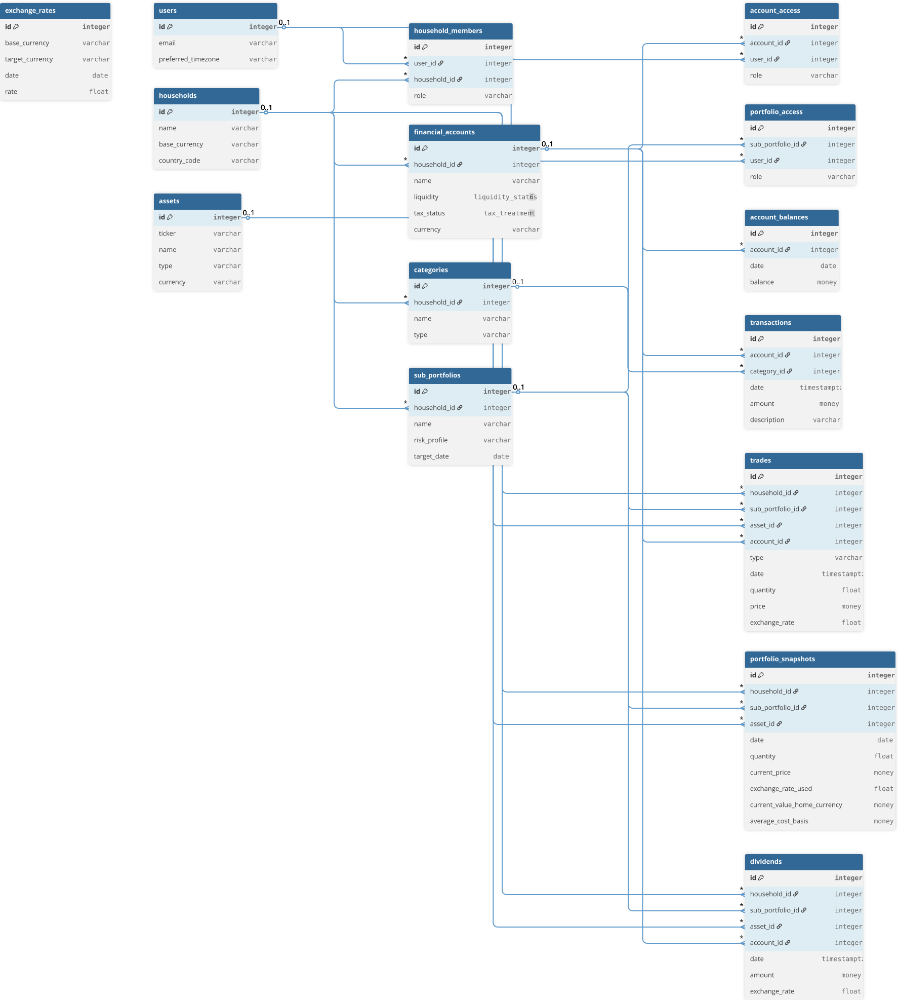

# Finance Tracker - Backend

High-performance financial analytics backend powered by FastAPI and Polars.

## 🛠 Tech Stack

-   **Framework**: [FastAPI](https://fastapi.tiangolo.com/)
-   **Analytics**: [Polars](https://pola.rs/) & [NumPy](https://numpy.org/) for vectorised financial calculations.
-   **ORM**: [SQLAlchemy 2.0](https://www.sqlalchemy.org/)
-   **Migrations**: [Alembic](https://alembic.sqlalchemy.org/)
-   **Database**: PostgreSQL 18
-   **Task Runner**: [uv](https://github.com/astral-sh/uv)

## 🚀 Getting Started

### Prerequisites
- Python 3.14+
- `uv` installed

### Setup
1.  Install dependencies:
    ```bash
    uv sync
    ```
2.  Set up your environment variables in `.env`.
3.  Run migrations:
    ```bash
    uv run alembic upgrade head
    ```
4.  Start development server:
    ```bash
    uv run fastapi dev src/main.py
    ```

## 📊 Analytics Engine

The backend includes a custom `snapshot_engine.py` that handles:
-   Daily balance and portfolio snapshots.
-   Historical currency conversion using `yfinance`.
-   Performance metrics calculation (TWR, IRR, Sharpe Ratio) using high-performance Polars operations.

## 🗄 Database Schema



## 🧪 Testing

Run the test suite using pytest:
```bash
uv run pytest
```

## 📝 API Documentation

Once the server is running, visit:
-   Swagger UI: `http://localhost:5001/docs`
-   ReDoc: `http://localhost:5001/redoc`
